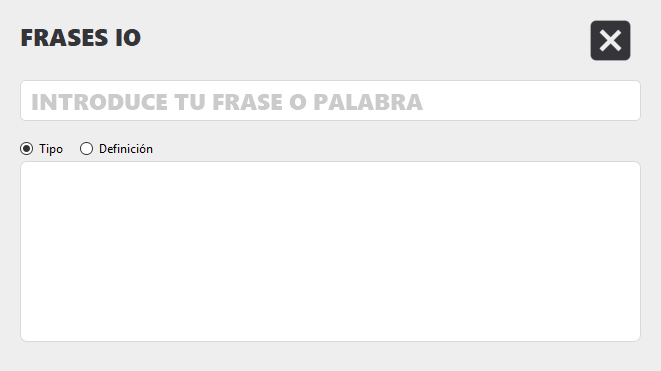

# Frases_IO_GUI
Aplicación de escritorio multiplataforma hecha en python.

## ¿Que es?
Es una aplicación que trata de que te dice que tipo es una palabra o su definición, puedes utilizar cualquier palabra o una frase.

## ¿Como utilizarla?
Dentro de la carpeta Frases_IO_GUI encontraras un archivo que se llama main.pyw, lo abres e introduces tu palabra o frase y pulsas
la tecla Enter.

Captura:

